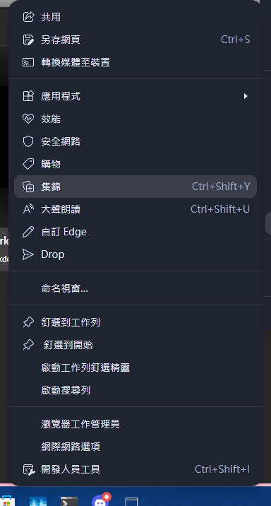
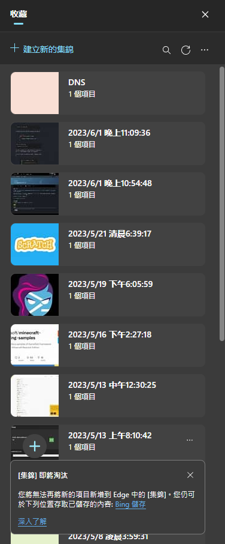
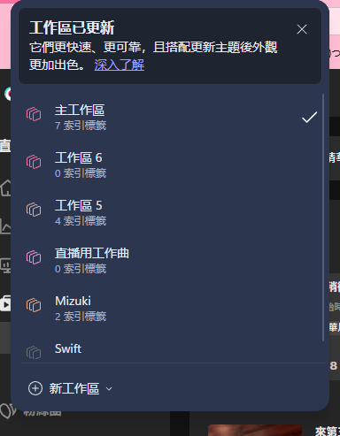
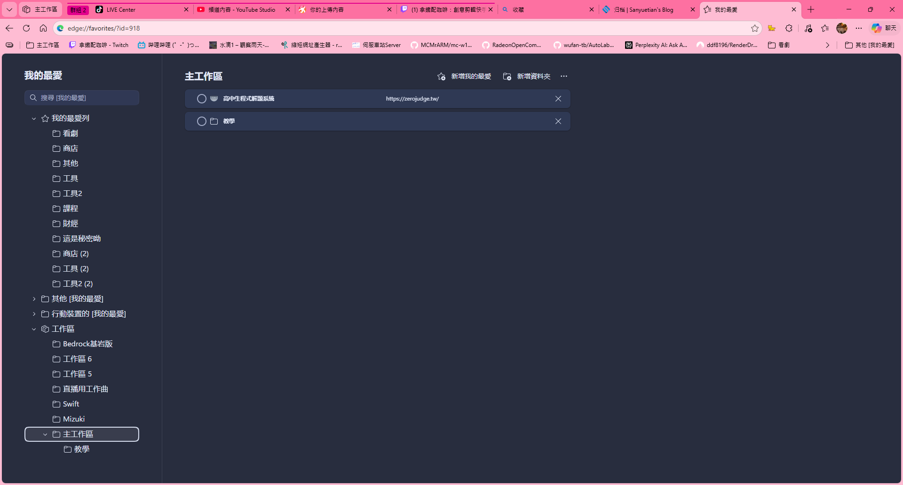

# 前言
之前有一段時間 我常用集錦 來存臨時想要收藏頁面

而在後續最近 我又正好 看到要收藏時 卻發現這個功能竟然要棄用了

哈 我個人是覺得這功能對於 不太想去翻自己新增我的最愛列/書籤頁的人是一種選擇

畢竟有的人書籤頁 可能很亂 造成不想去存翻

集錦到是 一組一組的 相對書籤頁我的最愛列 來的直觀

---

# 集錦的替代品 工作區?

隨之得知 集錦 要棄用後 取而代之 我想就是這個新加的工作區

他這工作區 除了單獨把一些頁面單獨存成一個工作區
同時也具有 往裡加我的最愛列 書籤的功能

只是後面我使用 發現牠似乎也存在一些問題

就是當你往裡面 單獨新增資料夾

你要刪除 可能會刪不掉 這點可能後續版本會修正

---

# 尾聲

集錦 它的功能 雖說跟原本我的最愛列功能大致相同

但對於 我的最愛列本身 比較像是一個大圖書館 裡面收藏記載了很多內容

平時你要找東西 通常在大圖書館相對沒那麼方便

而集錦 他則比較像是 一種 隨手記的形式

然後按時間排序或分類的 一組又一組的 比較像是一家一家店 明確記載了有什麼

而後頭更新的工作區 比較像是 這次不是 一家又一家店呢 而是你直接進入一家店裡

在這個店裡有什麼 你買什麼的情況 變得更明確了一點

專注於某幾組工作區 來回進行切換

本文到此就告一段落啦 你覺得 工作區這個功能如何了?

