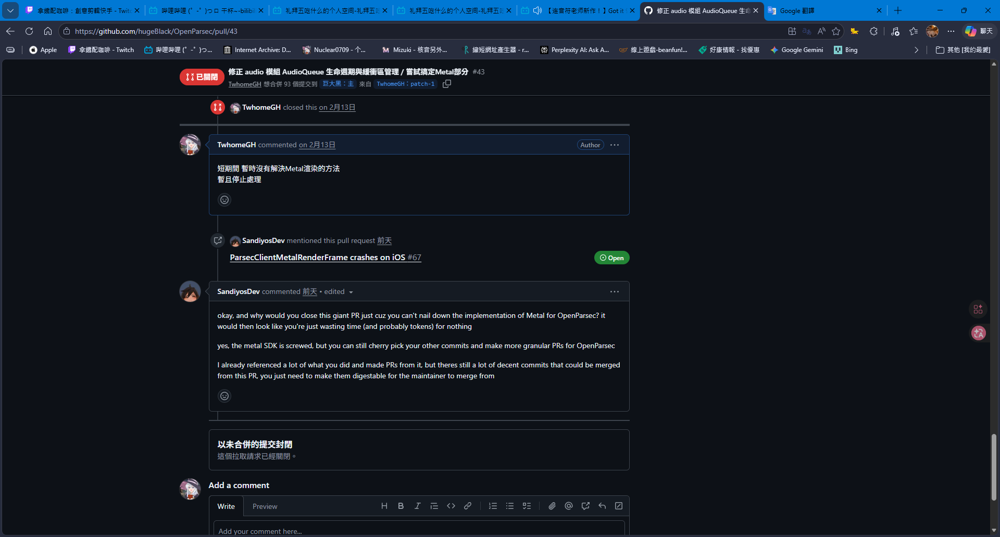

這次主要是解決了 大約2 - 3個月前 (2026.2月時) 始終沒搞定 Metal 渲染

起初 由於 OpenParsec iOS端這產物 是他以前遺留下來得產物

當初開發的SDK 不知道是什麼原因 反而不做了

::github{repo=hugeBlack/OpenParsec}

也就是後續開發就基於遺留的SDK 去做實現

他主要渲染處理是由以下這幾組去處裡的

- ParsecClientPollFrame
- ParsecClientGLRenderFrame
- ParsecClientMetalRenderFrame

遺留下來SDK 確定可用的就是只有GLRender哪組有效

MetalRender就是底層SDK內部就是半殘 有問題

後續可能沒開發完修正完項目就砍掉了

當時我嘗試了好一段時間都是失敗 畢竟他底層核心出錯

是在內部 renderPipe 根本沒建立或失敗造成的

然而在近期的 2026/5/9 - 5/11 這幾天 突然有人提?



```txt
okay, and why would you close this giant PR just cuz you can't nail down the implementation of Metal for OpenParsec? it would then look like you're just wasting time (and probably tokens) for nothing

yes, the metal SDK is screwed, but you can still cherry pick your other commits and make more granular PRs for OpenParsec

I already referenced a lot of what you did and made PRs from it, but theres still a lot of decent commits that could be merged from this PR, you just need to make them digestable for the maintainer to merge from

翻譯:

好吧，為什麼要因為沒能搞定 OpenParsec 的 Metal 實作而關閉這個巨大的 PR 呢？那樣看起來就像你在白白浪費時間（可能還有代幣）。

沒錯，Metal SDK 的確搞砸了，但你仍然可以從其他提交中挑選出一些，然後為 OpenParsec 創建更細粒度的 PR。

我已經參考了你做的很多工作，並基於這些工作創建了 PR，但這個 PR 裡仍然有很多不錯的提交可以合併，你只需要把它們整理得更容易理解，方便維護者合併即可。
```

HAA..沒有想到當時 我臨時爛尾

不打算繼續更動 所放棄合併的東西 打算只留給自己用的東西 會有人提..

隨後他提到的 我又跑回去處理 這個之前始終沒搞定 Metal 實作 的部分

後來經過我花一段時間的處理 甚至重新優化了 配置項管理 全局共享配置 之類的

# 最主要的是 我沒想到真解決 當時卡半天的 Metal渲染

主要這次思路 明顯跟我設想的差不多

前面提到 他主要處理渲染 由以下這3個處理

- ParsecClientPollFrame
- ParsecClientGLRenderFrame
- ParsecClientMetalRenderFrame

後面我看了一下 他的SDK另外兩個的意思是

- ParsecClientGLRenderFrame SDK完整處理的畫面 並餵給GLKView
- ParsecClientMetalRenderFrame SDK完整處理的畫面 並餵給MTKView

- ParsecClientPollFrame 我只拿原始畫面數據 不包含任何加工 給MTKView或GLKView

於是我就基於 ParsecClientPollFrame 取得畫面數據

然後走我自己新建的 renderPipe 管道 成功實現了 Metal 渲染

畢竟這Metal管道 是完整的嗎 HAA

::github{repo=TwhomeGH/OpenParsec}

分支 Patch-1 就是主要改動後的版本

至於這成功改動後的版本 要不要 ReOpen 重新開啟

[之前開的PR]("https://github.com/hugeBlack/OpenParsec/pull/43")

又是另一個問題 畢竟更新東西有點雜


