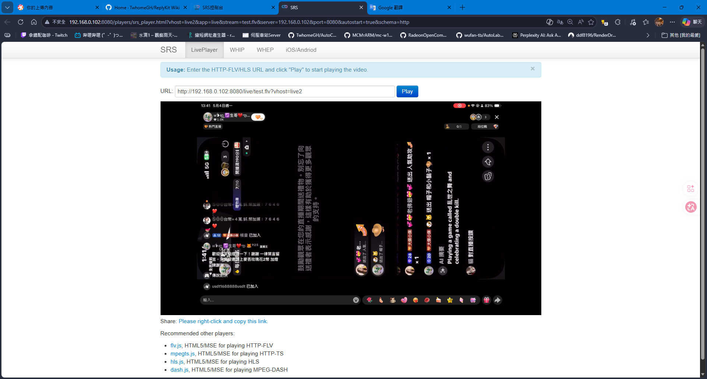

Metal 著色文件有時候改動後 得把應用刪掉重新裝

它的運作才恢復正常 雖說有些時候 是著色文件搞砸造成的 畫面異常

這一點是我在後續 開發 ReplyKit 推流應用 用側載安裝方式時間接發現的

::github{repo="TwhomeGH/ReplyKit"}

雖說著色文件處理 可能多多少少有點問題 發現撕裂拖影怪怪的

我也稍微修正了一下

後續我把應用刪掉 進行重裝後 撕裂拖影問題也就隨之消失了

從這一點看來 有可能舊著色資源文件殘留造成的

這一點 可能用 **側載** 安裝方式 比較容易發現此問題

常規 直接 **Xcode Build** 安裝到設備的可能沒有這個問題

覆蓋更新應用 有些時候不靠譜

基於此概念 任何有碰到系統內建錄製的功能 可能會有類似情況

使用TikTok/Twitch直接進行手機直播 如果他有改動與此相關的處理部分

很有可能覆蓋安裝 沒有正確更新對應部分 可能殘留著色器舊快取資源文件
