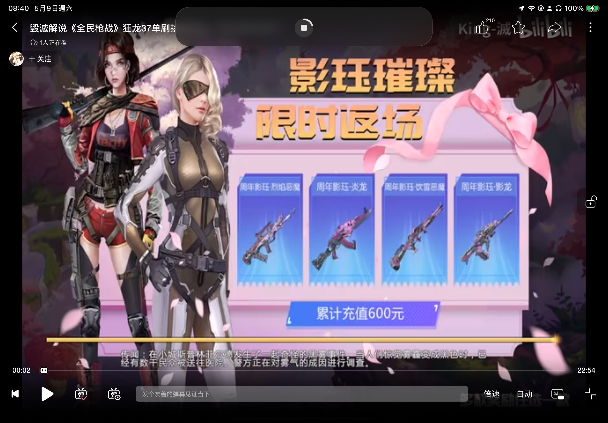
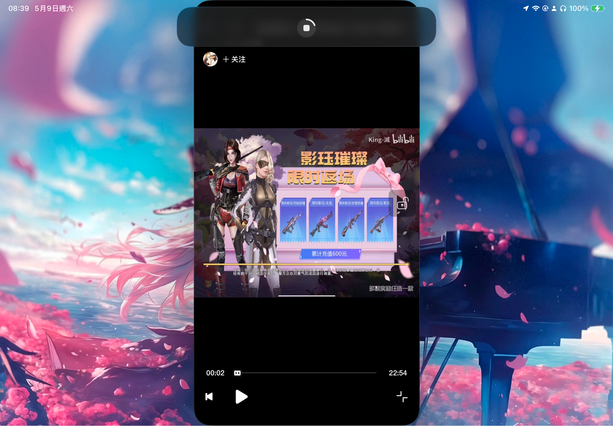
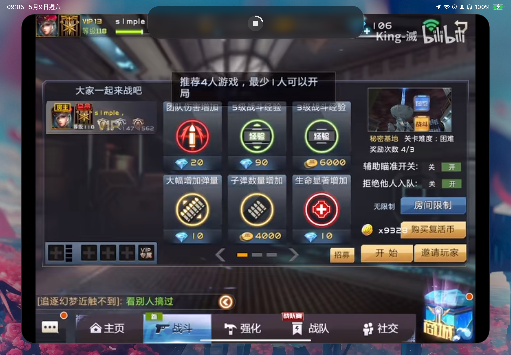
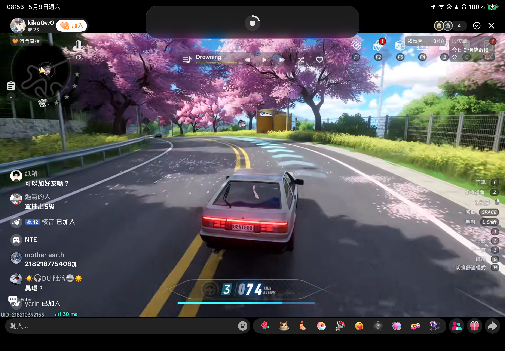

# 前言

```txt
[vf#0:0 @ 00000298853a8f00] Reconfiguring filter graph because video parameters changed to yuvj420p(pc, bt709), 1280x888
[swscaler @ 000002988ab38700] deprecated pixel format used, make sure you did set range correctly
[vf#0:0 @ 00000298853a8f00] Reconfiguring filter graph because video parameters changed to yuvj420p(pc, bt709), 1552x1080
[swscaler @ 000002988ba31a40] deprecated pixel format used, make sure you did set range correctly
```

這是一組 我最近 使用TikTok內建直播

回放 做重新編碼處理時發現的一組 關於分辨率變換的事情

來源是 2026.5.8 哪場直播的回放

# 為什麼會說 分辨率突然切換是危險的?

這一點主要是 他可能會破壞視頻數據 造成無法正常播放

這一點怎麼說呢 如果你原本分辨率 是訂在1920x1080

那麼你突然變成 1280x720 這或許沒什麼問題

這兩種 分辨率 其實還是保持在同一個 16:9 比例下

所以可能 沒什麼問題

--- 

好 那我重點 看一下這個輸出發生了什麼?

```txt
[vf#0:0 @ 00000298853a8f00] Reconfiguring filter graph because video parameters changed to yuvj420p(pc, bt709), 1280x888
[swscaler @ 000002988ab38700] deprecated pixel format used, make sure you did set range correctly

[vf#0:0 @ 00000298853a8f00] Reconfiguring filter graph because video parameters changed to yuvj420p(pc, bt709), 1552x1080
[swscaler @ 000002988ba31a40] deprecated pixel format used, make sure you did set range correctly
```

主要就兩件事

1. 重新配置分辨率 為1280x888 然後又重新配置回 1552x1080
2. 他使用了 已棄用的像素格式

---

那麼問題是什麼呢?

# 分辨率變換 怕的是哪一種情況呢?

這一點主要怕的是 16:9 變 9:16 這種情況

白話就是 原本橫式的變成直式的

比例突然變換 這也是一個比較危險的

# 那麼 出現像 1280x888 變回 1552x1080 就不危險嗎?

這一點 其實比較偏向 **潛在風險**

實際播 視頻是沒什麼問題

通常是**絕對不要發生這種情況的** 應該**始終保持一致分辨率**

對視頻來講會安全許多

通過這一點 其實也間接得知

他在某個環節 突然配置 成輸出成 **1280x888**

然後 又重新覆蓋配置回 目標 **1552x1080**

這一點 其實在我自己開發 **松鼠推流** 某一段時期 **開發版** 也有**類似思路造成的相同的問題**

::github{repo=TwhomeGH/ReplyKit}

---

# iOS 推流開發 對分辨率的處理

起初是我有一段時間 為了適配 

讓他不要 以原本 **4:3** 直接輸出 而是變 **16:9**

所做的處理

# 為啥要變 **16:9** 比例?

這一點相信 你有在用 iPad 看視頻或直播 應該深有感受

當你點進的直播或視頻 是 **4:3** 時

你可能會看到如下圖



主要的問題就是 他會把裡平板整個畫面填充的滿滿

包括UI介面 這一點如果你是看直播 那應該會發現UI擋到畫面了




由於應用 他那適應 **4:3** 調節很詭異

這一點雖然 透過 iOS 26的台前調度 或 視窗 App 也許能改善

但體驗相對比較差..

至於 他這 **4:3** 填充 UI擋畫面 直播應該是更明顯



在原本視頻 就是 **16:9** 下 那些UI介面反而是不至於擋到畫面

但如果視頻不是 **16:9** 而是 **4:3** 這一點

很有可能就會出現 UI擋到介面的問題

尤其是現在用 iPad直播 大概率 都是 4:3

所以當你 在看這類直播時 應該會更明顯

而 **16:9** 下則比較少出現UI擋介面 的問題 大部分都會分隔開

不會擠在一塊

這也就是為啥 要把畫面 打包成 **16:9**

# 那麼當時設計 適應這 **16:9** 是怎麼設計呢

因為主要是使用 `HaishinKit` 進行畫面處理

::github{repo=HaishinKit/HaishinKit.swift}


以下是一段 示例 `HaishinKit` 控制輸出畫面的部分 

```swift

var videoSettings = await rtmpStream.videoSettings

let newSize: CGSize

newSize = CGSize(width: CGFloat(1080), height: CGFloat(1920))

videoSettings.profileLevel = kVTProfileLevel_H264_ConstrainedHigh_AutoLevel as String
videoSettings.scalingMode = .letterbox

videoSettings.videoSize = newSize
videoSettings.expectedFrameRate = 60.0

```

起初在為了實現 **16:9** 發現一個比較偷懶的方式

也就是直接設 `HaishinKit` 的輸出寬高

但後面發現 這樣是有潛在風險

因為原始輸出 1920x1334 是 這一點是 ReplyKit 透過 `processSampleBuffer` 送進來的原始畫面

```swift
override func processSampleBuffer(_ sampleBuffer: CMSampleBuffer, with sampleBufferType: RPSampleBufferType) {

    switch sampleBufferType {
        case .video:
            // 你的畫面處理管道
            break

        case .audioApp, .audioMic:
            // 你的音訊道
            break
    }

}
```

由於 ReplyKit 他送進來的畫面比較詭異

是直的 1920x1334 然後還有點 是你如果要讓他橫式的顯示 寬高需要對調

由於原始是直的 所以才會另外設計GPU管線 把他轉成橫的 也就是畫面轉 90度

那麼當你只改 `HaishinKit` 的輸出寬高

就有可能出現 有些時候 如果 `HaishinKit` 的內部處理

沒有把你送進來調好 塞進 你指定的 **1920x1080** 自適應寬高

就會造成 他就會變成把原始寬高 送出去 變成 **1920x1334** 之類的問題

也就會造成 類似 `FFMPEG` 裡重新編碼會看到的

```txt
[vf#0:0 @ 00000298853a8f00] Reconfiguring filter graph because video parameters changed to yuvj420p(pc, bt709), 1280x888
[swscaler @ 000002988ab38700] deprecated pixel format used, make sure you did set range correctly
[vf#0:0 @ 00000298853a8f00] Reconfiguring filter graph because video parameters changed to yuvj420p(pc, bt709), 1552x1080
[swscaler @ 000002988ba31a40] deprecated pixel format used, make sure you did set range correctly
```

這一點 因為你只改了 `HaishinKit` 輸出寬高
但原始該是 **1920x1334** 就是這個寬高

這相當就變成兩組 寬高配置
在某些 時候 如果他沒有正確套用 或處理不及時 把原始畫面送進去

那就出現上面類似的情況 甚至有造成 最終影片無法播放的潛在問題

也有可能造成 你首次推流 無法推上去畫面 直接斷線的問題

所以後面 改進就變成 **直接讓最終輸出產物 是目標的寬高**

這樣就始終保持 **不存在 兩組不同寬高** 分辨率

目前改進後 整體流程 是長這樣

```
ReplyKit 原始畫面 1920x1334 ->          GPU處理管線                -> 送出最終畫面
    (不同設備可能會有不同)        把畫面重新處理 並適應成 **16:9**
```

原本的話 可能會像這樣

```
ReplyKit 原始畫面 1920x1334 ->         GPU處理管線         -> `HaishinKit` 送出最終畫面
    (不同設備可能會有不同)      把畫面重新處理 還是 **4:3**           處理成 **16:9**
```

原本的做法 最大問題 就在於 `HaishinKit` 如果處理不及時 會變 直接用 上一層 GPU處理管線 原始的寬高 也就是 **4:3**

而改進後 這是把這活 全交給 GPU處理 確保最終送出的畫面結果一致

經過這改進 明顯是沒有了 之前老是第一次推流 一直推不上去的問題

第二次就正常的問題 這一點主要是 推流到 **Restream** 發現有這個問題

主要這問題核心 算是**原始處理不乾淨** 造成的

所以本文這次 所提及**分辨率突然變換風險** 主要就是可能造成此類問題

# 尾聲

本文大致 就告一段落啦

所以在處理推流畫面時 最好保持分辨率的一致

# 其餘補充

雖說原始版本 處理方式 在 **Restream** 會發生首次斷線

但這一點在 **Twitch** 反而是沒有問題

所以這分辨率變換問題 其實也看各平台的服務器處理情況 可能會有所不同


