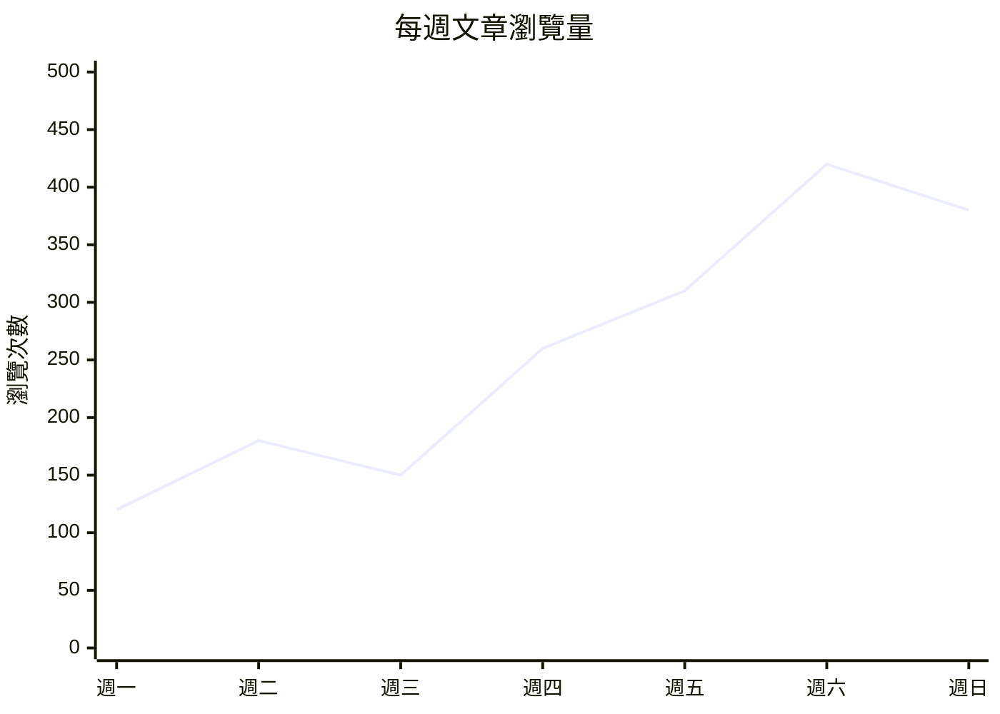
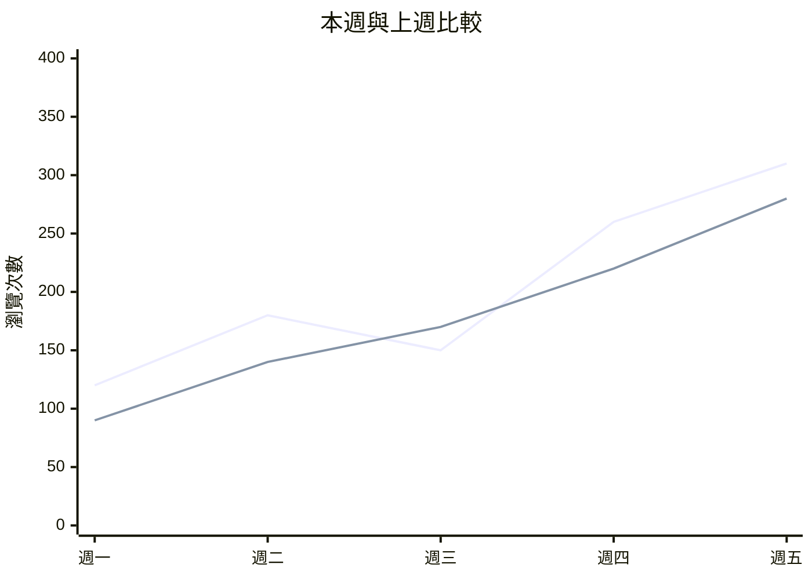

## 直接貼進 Markdown 的折線圖

本專案已支援 Mermaid。程式碼區塊的語言要寫 `mermaid`，區塊內用 `xychart-beta` 宣告 XY 圖，再以 `line` 提供數值。不需要安裝新的 Markdown 外掛。

下面四個反引號包住的區塊是語法展示；複製其中的三反引號區塊到文章即可繪圖。

````markdown

````

### 實際效果


### 每一行的意思

| 語法 | 用途 |
| --- | --- |
| `xychart-beta` | 宣告 XY 圖表 |
| `title "每週文章瀏覽量"` | 圖表標題 |
| `x-axis ["週一", "週二", ...]` | X 軸分類，依陣列順序排列 |
| `y-axis "瀏覽次數" 0 --> 500` | Y 軸標題與顯示範圍 |
| `line [120, 180, ...]` | 每個分類對應的 Y 值，依序連成折線 |

分類數量應與每組資料數量一致。數值不要附加單位，例如寫 `120`，不要寫 `120次`；單位放在軸標題。中文標題與標籤使用雙引號。若不確定範圍，可以只寫 `y-axis "瀏覽次數"`，讓 Mermaid 根據資料決定範圍。

## 同一張圖顯示兩條線

重複寫 `line` 就能增加資料系列。這個範例依序是本週與上週；此處使用基本語法，不依賴較新版本才提供的命名系列與圖例功能。

````markdown

````


日期在這種寫法中屬於分類標籤，間距相等；不會按實際相隔天數調整。若需要不規則時間軸、滑鼠提示或可切換資料系列，應另做專門的圖表組件。

## 本專案如何解析

1. `astro.config.mjs` 的 `markdown.processor: unified(...)` 已註冊 `remarkMermaid` 與 `rehypeMermaid`。
2. `src/plugins/remark-mermaid.js` 辨識語言為 `mermaid` 的程式碼區塊，保留原始圖表文字。
3. `src/plugins/rehype-mermaid.mjs` 產生圖表容器並注入渲染腳本。
4. `src/plugins/mermaid-render-script.js` 在瀏覽器載入 Mermaid 11，呼叫 `mermaid.render()`，再顯示 SVG 圖片並附上縮放控制。

新增折線圖只需修改文章。只有要改載入來源、渲染時機、主題或錯誤處理時，才需要改渲染腳本。Markdown 原生不負責繪圖；這是本站提供的功能，其他 Markdown 閱讀器是否支援需另外確認。

目前 Mermaid 從 jsDelivr 載入，失敗時嘗試 unpkg。即使文章網站在區域網路上，平板仍需要能連上 CDN 才能首次載入繪圖程式。靜態建置成功不代表瀏覽器端的每張圖都已成功解析，修改語法後也要在頁面確認圖表。

需要點選資料點查看數值？請看 [ECharts 互動圖表示例](/posts/echarts-interactive-example/)。

## 圖表大小與操作

圖表預設依文章可用寬度顯示完整內容，並保留原始長寬比例。一般滾輪與觸控滑動可繼續閱讀文章，不會自動縮放圖表。

圖表預設鎖定位置，放大也不會自動解除鎖定。按「解除鎖定」後，即使在 100% 也能直接用滑鼠或觸控拖曳，亦可使用方向鍵移動；需要細看時再按「＋」放大；按「鎖定位置」可固定目前視角。「適合寬度」會重新鎖定並回到完整圖表；聚焦圖表後也可以按 Escape 還原。工具列獨立排列，不會遮住標題或座標軸。

## 常見問題

- 只出現程式碼：確認外層使用三個反引號加 `mermaid`，而不是語法展示用的四反引號 `markdown` 區塊。
- 出現解析錯誤：確認括號、雙引號與逗號完整，並先用本文的最小範例測試。
- 圖表一直載入：檢查瀏覽器 Network 中的 Mermaid CDN 請求。
- 資料超出範圍：調整 Y 軸上下限，或移除固定範圍。

完整語法可參考 [Mermaid 官方 XY Chart 文件](https://mermaid.js.org/syntax/xyChart.html)。
