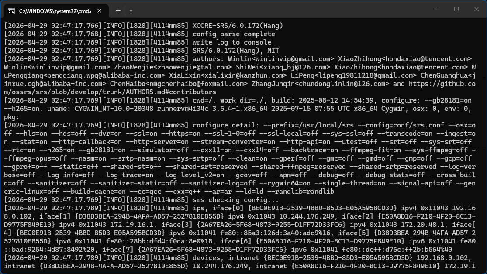
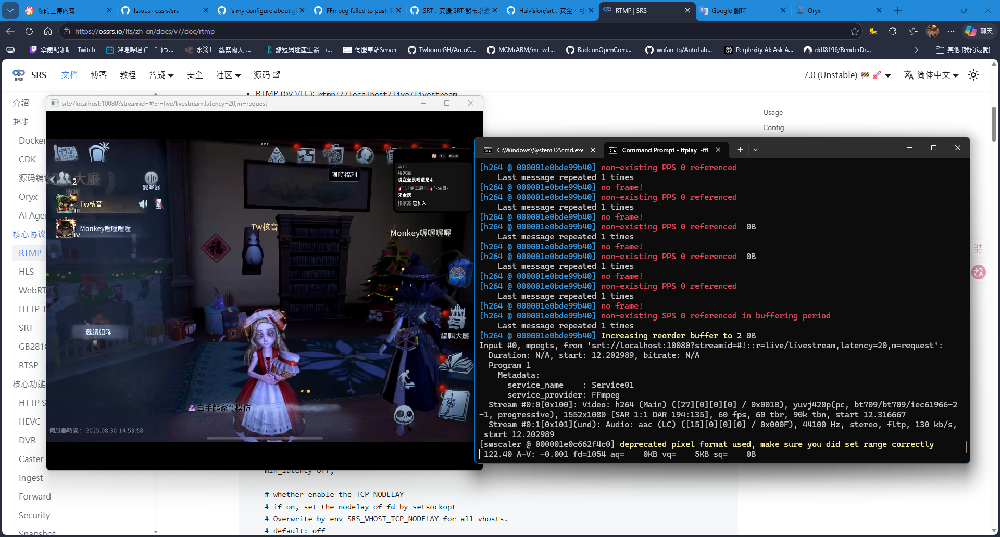
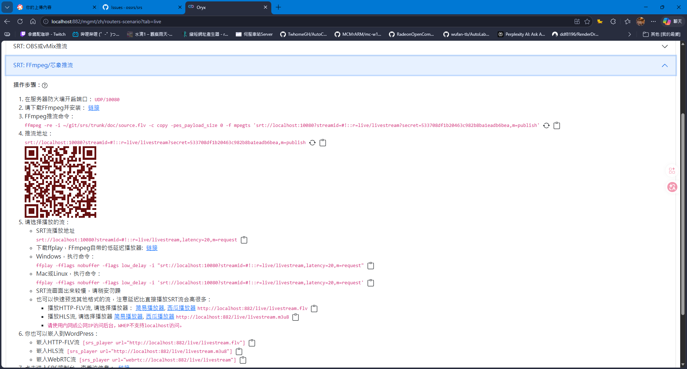
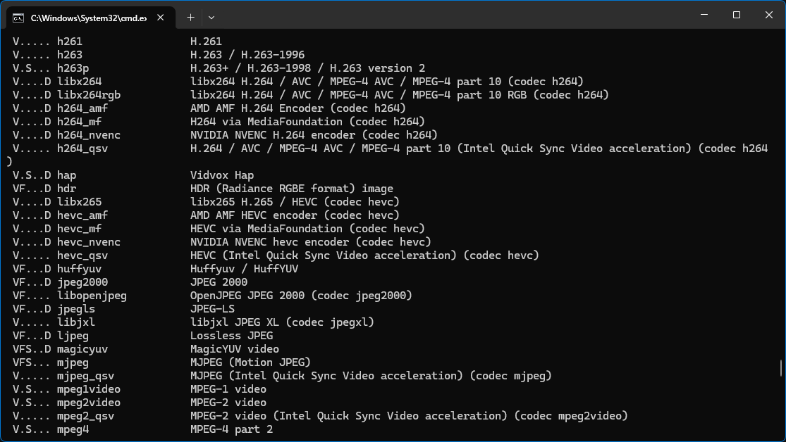
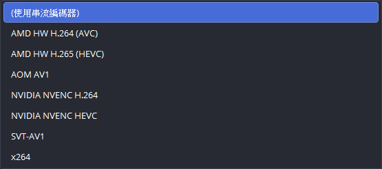

# 在Windows環境下 如何使用SRT推流

這在我觀察後發現\
其實如果用的不是 **Docker版本** 他是沒有編譯**SRT模塊**\
可以從這張圖看出




仔細看 可以看到 `--srt=off`

這代表這版 Windows直接安裝包的版本 他是沒有包含SRT的\
所以如果要用要嘛 用 **Docker版本** 或 **源碼編譯**

很顯然 當然是直接改用**ORXY版** 也就是**Docker**的是最簡單的方式

這裡就不做ORXY/SRS的安裝說明了

直接看下一張圖



好這張圖就是推流成功後的樣子

接著我們看最後一張圖



這個部分我們就可以看到 他明確說明了 怎麼**推流**與**拉流**

對於 **SRT推流地址** 他是長這樣

```
srt://localhost:10080?streamid=#!::r=live/livestream,secret=533708df1b20463c982b8ba1eadb6bea,m=publish
```

主要核心是從 `#!::` 後就是他的本體

## 開頭地址

`srt://localhost:10080?streamid=#!::`

## 主要內容

```
r=live/livestream,secret=533708df1b20463c982b8ba1eadb6bea,m=publish
```

| 參數 | 說明 |
| -- | -- |
| r  | 也就是流起始指向點 |
| h | 這個在官方說明 是用來指向vhost |
| secret | 這是推流驗證密鑰 這點ORXY本身會預設啟用的 |
| m | 推流 或 播流 模式 核心 |

以下是拉流的版本

```shell
ffplay -fflags nobuffer -flags low_delay -i "srt://localhost:10080?streamid=#!::r=live/livestream,latency=20,m=request"
```

可以看到 `m` 變成 `request` 代表拉流

`latency=20` 很明確就是延遲 這裡看 應該是20ms的意思

單獨抽出來看 **拉流地址** 會長這樣

```
srt://localhost:10080?streamid=#!::r=live/livestream,latency=20,m=request
```

一樣他的主體是從 `#!::` 之後開始

然後參數之間 以 `,` 區隔開


這主要就是 **推流跟拉流** 的說明


接著額外說一下 **FFMPEG** 直接推流的部分

雖然應該大多數都是用**OBS**這類比較多


```shell
ffmpeg -re -i "./FCutV2025.8.30-2大松鼠稍微來播一回吧2.mp4" -c copy -pes_payload_size 0 -f mpegts "srt://localhost:10080?streamid=#!::r=live/livestream,secret=533708df1b20463c982b8ba1eadb6bea,m=publish"
```

### 為什麼要特別說這個呢?

因為他與 **RTMP推流格式** 上有點不同之處

一般 **RTMP推流** 是長這樣

```shell
ffmpeg -re -i "./FCutV2025.8.30-2大松鼠稍微來播一回吧2.mp4" -c copy -f flv "rtmp://localhost/live/test3?vhost=live2"
```

主要區別 是在這部分

`-pes_payload_size 0 -f mpegts`

SRT是用指定輸出MPEG TS檔 也就HLS常見的

`-pes_payload_size` 則是自動封包大小 通用配置

一般 RTMP 則是使用 `-f flv` 以FLV封裝送出


雖說有點差異 主要還是在他推流地址 命名傳遞方式 稍有不同

### SRT推流 真的有優於 RTMP 嗎?

這點就有待評價 新的技術 相對會優於 舊技術

但伴隨著的問題是 **兼容性**

目前看來 **RTMP協議** 屬於是根深蒂固

雖然老 但他 兼容性 目前為止還是最廣最常見通用的直播協議

這一點與 **MP4** 類同 也就是 **H.264編解碼**

目前主要還是以 **H.264** 為主

而 **SRT** 則是 以 **H.265編解碼為主** 也就 **HEVC**

使用 編解碼 你會看到像 `libx264` `libx265`

顯卡處理則是 會像 `h264_nvenc` `h264_amf` `hevc_nvenc` `hevc_amf`

如果你想得知 可用的編碼器 可以透過


### 編碼器 推流用輸出
```shell
ffmpeg -encoders
```

### 解碼器 看影片時使用

```shell
ffmpeg -decoders
```



通常我們輸出影片或直播主要 用的都是編碼器

OBS 看到的編碼器 x264(CPU編碼)



OBS裡見到的 NVIDIA NVENC H264 就是指顯卡編碼

# 尾聲

SRT目前比較可惜 還沒變的像RTMP兼容哪麼廣

目前還是大多數 還是選擇 以RTMP直播服務器為主

SRT直播服務器 雖說有但目前有做的還是比較少

加上談論的人比較少 技術文檔也較於匱乏

本文到這裡就告一段落啦\
希望對於此陌生的 **SRT推流方式** 能有一定的了解 推流與拉流方式


